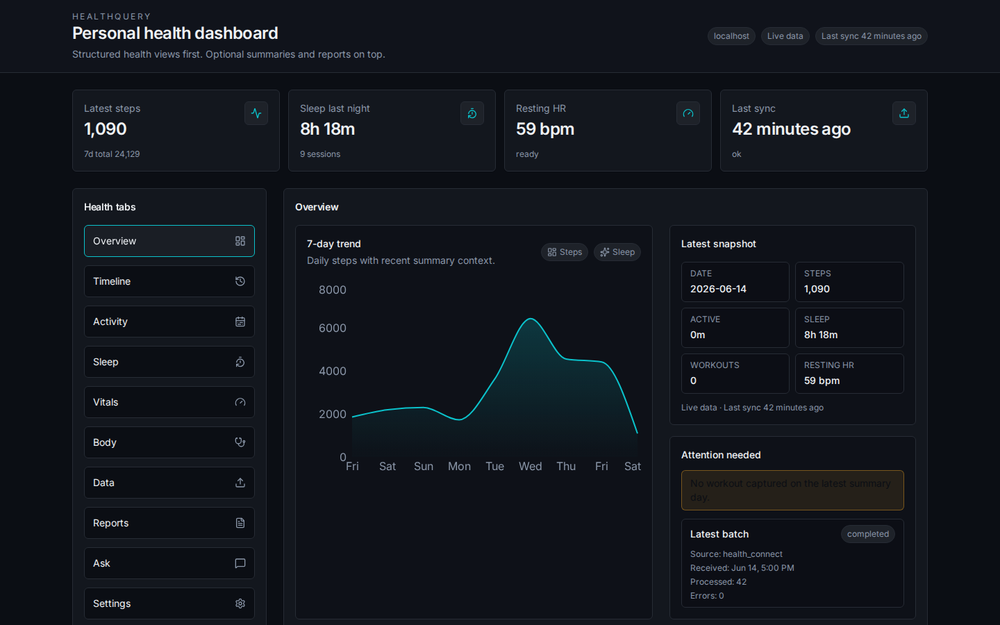
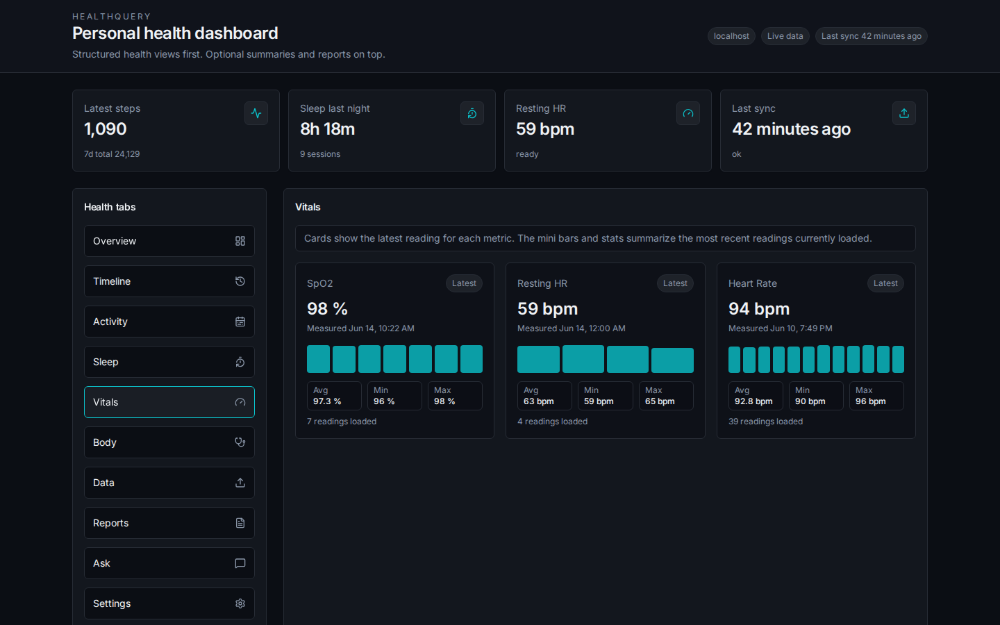

# HealthQuery

A self-hosted personal health dashboard. Your phone syncs health data from Android Health Connect to a local server. You view it in a browser, generate structured reports, and optionally ask questions about your data using an LLM of your choice.

No cloud services required. Data stays on your own hardware.





---

## How it works

1. An Android app ([Real Life Dashboard Companion](https://github.com/owen282000/life-dashboard-companion-app)) reads your health data from Health Connect and posts it to your server via webhook.
2. The backend stores it in a local SQLite database.
3. You open a browser to view your steps, sleep, vitals, and body metrics; generate doctor-visit summaries; or ask natural-language questions about your data.

---

## Prerequisites

- Docker and Docker Compose
- An Android phone with [Health Connect](https://play.google.com/store/apps/details?id=com.google.android.apps.healthdata) installed
- [Real Life Dashboard Companion](https://github.com/owen282000/life-dashboard-companion-app) app configured as the webhook source
- A server reachable from your phone (home server, VPS, or local machine)

---

## Setup

### 1. Clone the repo

```bash
git clone https://github.com/your-username/healthquery.git
cd healthquery
```

### 2. Create your config

```bash
cp docker-compose.example.yml docker-compose.yml
```

Open `docker-compose.yml` and set two tokens. Generate them however you like — a password manager, `openssl rand -base64 32`, or any random string:

```yaml
HEALTHQUERY_INGEST_TOKEN: your-ingest-token-here   # the companion app uses this
HEALTHQUERY_READ_TOKEN:   your-read-token-here      # the dashboard uses this
```

Keep these separate. The ingest token only permits writing health data. The read token only permits reading it.

### 3. Start the containers

```bash
docker compose up -d
```

The dashboard is now running on port `3135`.

### 4. Set up a reverse proxy (recommended)

Point nginx, Caddy, or Traefik at `http://localhost:3135`. The frontend handles routing; all API calls go through `/api/`.

If you expose the server to the internet, use HTTPS.

### 5. Configure the companion app

See [Data source](#data-source) below for how to point the app at your webhook URL and set the ingest token.

---

## Data source

HealthQuery receives data from **[Real Life Dashboard Companion](https://github.com/owen282000/life-dashboard-companion-app)**, an Android app that reads from Health Connect and posts to a configurable webhook.

In the companion app settings, set:

| Field | Value |
|-------|-------|
| Webhook URL | `https://your-server/api/webhook/health` |
| Auth header | `X-Webhook-Token` |
| Auth token | your ingest token |

The companion app handles syncing schedules. After the first sync, your data appears in the dashboard.

**What gets synced:** steps, distance, calories, heart rate, resting heart rate, heart rate variability, SpO2, sleep sessions and stages, weight, body fat, workouts, and more.

---

## Dashboard tabs

| Tab | What it shows |
|-----|---------------|
| Overview | 7-day step trend, latest snapshot, day-over-day comparisons |
| Timeline | Chronological feed of all health events |
| Activity | Daily steps, workout list |
| Sleep | Session list with stage breakdown |
| Vitals | Heart rate, resting HR, HRV, SpO2 — latest reading per metric |
| Body | Weight, body fat, and other body composition metrics |
| Data | Record counts, recent ingest batches, sync status |
| Reports | Structured doctor-visit summary for a date range |
| Ask | Natural-language questions about your data (requires LLM) |
| Settings | Configure LLM endpoint, view operational defaults |

---

## LLM setup (optional)

Without an LLM, Reports generates a structured text summary from your data. The Ask tab is hidden.

With an LLM, Reports can rewrite summaries in natural language and Ask answers free-form questions about your health data.

Configure it in the **Settings** tab — no rebuild needed. Or set environment variables in `docker-compose.yml` before the first start:

```yaml
HEALTHQUERY_LLM_BASE_URL: https://api.openai.com/v1
HEALTHQUERY_LLM_MODEL:    gpt-4o-mini
HEALTHQUERY_LLM_API_KEY:  sk-...
```

Any OpenAI-compatible endpoint works. For a local model:

```yaml
HEALTHQUERY_LLM_BASE_URL: http://ollama:11434/v1
HEALTHQUERY_LLM_MODEL:    llama3
HEALTHQUERY_LLM_API_KEY:  ""
```

Settings saved in the UI override environment variables without a container rebuild.

---

## MCP server (optional)

HealthQuery includes an [MCP](https://modelcontextprotocol.io) server that exposes your health data to AI assistants like Claude Desktop.

The MCP server runs as a local stdio process and reads from your HealthQuery API. Configure it by pointing it at your server URL and read token:

```bash
HEALTHQUERY_BASE_URL=http://localhost:3135 \
HEALTHQUERY_READ_TOKEN=your-read-token \
python backend/mcp_server.py
```

For Claude Desktop, add to your `claude_desktop_config.json`:

```json
{
  "mcpServers": {
    "healthquery": {
      "command": "python",
      "args": ["/path/to/healthquery/backend/mcp_server.py"],
      "env": {
        "HEALTHQUERY_BASE_URL": "http://localhost:3135",
        "HEALTHQUERY_READ_TOKEN": "your-read-token"
      }
    }
  }
}
```

---

## Environment variables

All variables go in `docker-compose.yml` under `healthquery-api` → `environment`.

| Variable | Required | Default | Description |
|----------|----------|---------|-------------|
| `HEALTHQUERY_INGEST_TOKEN` | Yes | — | Token the companion app sends with each sync |
| `HEALTHQUERY_READ_TOKEN` | Yes | — | Token the dashboard uses to read data |
| `HEALTHQUERY_AUTH_HEADER` | No | `X-Webhook-Token` | Header the companion app sends the ingest token in |
| `HEALTHQUERY_LOG_LEVEL` | No | `INFO` | Log verbosity (`DEBUG`, `INFO`, `WARNING`) |
| `HEALTHQUERY_LLM_BASE_URL` | No | — | OpenAI-compatible API base URL |
| `HEALTHQUERY_LLM_MODEL` | No | — | Model name (e.g. `gpt-4o-mini`, `llama3`) |
| `HEALTHQUERY_LLM_API_KEY` | No | — | API key (leave blank for local models) |
| `HEALTHQUERY_LLM_TIMEOUT_SECONDS` | No | `60` | LLM request timeout |
| `HEALTHQUERY_CORS_ORIGINS` | No | `*` | Comma-separated allowed CORS origins (e.g. `https://health.example.com`) |
| `DB_PATH` | No | `/app/data/healthquery.db` | SQLite database path inside the container |

The frontend build also takes two build args:

| Arg | Default | Description |
|-----|---------|-------------|
| `VITE_API_BASE_URL` | `/api` | API base path (change if not using the built-in nginx proxy) |
| `VITE_READ_TOKEN` | — | Read token baked into the frontend build |

---

## Tech stack

**Backend:** Python 3.11, FastAPI, aiosqlite, SQLite (WAL mode), sqlglot (SQL guard), FastMCP

**Frontend:** React 19, TypeScript, Vite, Tailwind CSS, Recharts

**Infrastructure:** Docker, nginx (serves frontend + proxies `/api/` to backend)

---

## Data and privacy

All data is stored in a single SQLite file on your server. Nothing is sent to external services unless you configure an LLM endpoint.

The ingest and read tokens are separate by design. A compromised read token can't write data. A compromised ingest token can't read it.

The free-form SQL query endpoint (`POST /api/health/query`) runs queries through an AST whitelist that only permits single `SELECT` statements — no mutations, no `ATTACH`, no multi-statement execution.

---

## Development

### Backend

```bash
cd backend
python -m venv .venv && source .venv/bin/activate
pip install -r requirements.txt
DB_PATH=./dev.db HEALTHQUERY_INGEST_TOKEN=dev HEALTHQUERY_READ_TOKEN=dev uvicorn main:app --reload
```

### Frontend

```bash
cd frontend
npm install
VITE_API_BASE_URL=http://localhost:8000/api VITE_READ_TOKEN=dev npm run dev
```

### Tests

```bash
cd backend && pytest
```

---

## License

MIT
